<div align="center">

# 🧠 Face Recognition System
### A Comparative Study of Deep Face Recognition Loss Functions


*Implementing, training, and benchmarking three landmark face recognition loss functions — ArcFace, Triplet Loss, and SphereFace — toward building a production-ready attendance system.*

</div>

---

## 📌 Table of Contents

- [Overview](#overview)
- [Motivation](#motivation)
- [Research Papers](#research-papers)
- [Datasets](#datasets)
- [Architecture](#architecture)
- [Experiments](#experiments)
  - [Round 1 — Initial Training & Baseline Results](#round-1--initial-training--baseline-results)
  - [Round 2 — Investigating Data Scaling for Triplet Loss](#round-2--investigating-data-scaling-for-triplet-loss)
  - [Round 3 — Full Convergence & Fixed Triplet Mining](#round-3--full-convergence--fixed-triplet-mining-coming-soon)
- [Final Model Selection](#final-model-selection)
- [Project Roadmap](#project-roadmap)
- [Installation & Usage](#installation--usage)
- [Repository Structure](#repository-structure)
- [Citation](#citation)

---

## Overview

This repository is a systematic research effort to implement and evaluate three of the most influential deep face recognition methodologies from scratch:

| Method | Loss Type | Core Idea |
|---|---|---|
| **Triplet Loss** | Metric Learning | Directly optimizes embedding distances via anchor-positive-negative triplets |
| **SphereFace** | Multiplicative Angular Margin | Deep hypersphere embedding with multiplicative angular penalty |
| **ArcFace** | Angular Margin | Additive angular margin in the hyperspherical embedding space |

The ultimate goal is to select the best-performing approach for integration into a **real-world attendance system**, where identity verification must be fast, accurate, and robust to real-world variation (lighting, pose, expression).

---

## Motivation

Classical softmax-based classifiers struggle with the open-set face verification problem — recognizing identities never seen during training. Metric learning and margin-based loss functions address this by learning embedding spaces with strong intra-class compactness and inter-class separability. This project compares these three paradigms under controlled, identical training conditions to determine which is best suited for a deployment-ready attendance system.

---

## Research Papers

| # | Paper | Authors | Venue | Link |
|---|---|---|---|---|
| 1 | **FaceNet: A Unified Embedding for Face Recognition and Clustering** *(Triplet Loss)* | Schroff et al. | CVPR 2015 | [📄 arXiv:1503.03832](https://arxiv.org/abs/1503.03832) |
| 2 | **SphereFace: Deep Hypersphere Embedding for Face Recognition** | Liu et al. | CVPR 2017 | [📄 arXiv:1704.08063](https://arxiv.org/abs/1704.08063) |
| 3 | **ArcFace: Additive Angular Margin Loss for Deep Face Recognition** | Deng et al. | CVPR 2019 | [📄 arXiv:1801.07698](https://arxiv.org/abs/1801.07698) |

---

## Datasets

### 🏋️ Training & Validation — VGGFace2 (112×112)

> **Dataset:** [VGGFace2 112×112 — Kaggle](https://www.kaggle.com/datasets/yakhyokhuja/vggface2-112x112)

| Property | Value |
|---|---|
| Subjects | ~9,000 identities |
| Images | ~3.3 million |
| Resolution | 112 × 112 |
| Split Used | Train / Validation |

⚠️ **Important Note on Data Usage**

Due to the large scale of VGGFace2 (~3.3M images), a **controlled capped subset** was used across all experiments, with the cap size varying by round and model based on the specific hypothesis being tested. This approach ensures practical training efficiency while maintaining experimental control.

---

### 🧪 Testing — LFW (Labeled Faces in the Wild)

> **Dataset:** [LFW Facial Recognition — Kaggle](https://www.kaggle.com/datasets/quadeer15sh/lfw-facial-recognition)

| Property | Value |
|---|---|
| Subjects | 5,749 identities |
| Images | ~13,233 |
| Pairs (eval) | 1,000 |
| Protocol | Unrestricted, labeled outside data |

---

## Architecture

All three models share the same backbone to ensure a fair comparison. Only the loss function and training head differ.

```
                    Input Image (112×112×3)
                          │
                          ▼
                    Backbone CNN  (ResNet-50)
                          │
                          ▼
                    Feature Embedding  (512-D L2-normalized vector)
                          │
       ┌──────────────────│─────────────────────┐
       ▼                  ▼                     ▼
  [Triplet Loss]      [ArcFace]           [SphereFace]
    Head                Head                  Head
```

---

## Experiments

### Round 1 — Initial Training & Baseline Results

> **Objective:** Train all three models on a small VGGFace2 subset and record baseline performance on LFW. This round is exploratory — training was intentionally stopped early for ArcFace and SphereFace, and serves as a starting point for hypothesis formation.

#### ⚙️ Training Configuration

| Hyperparameter | Value |
|---|---|
| Backbone | ResNet-50 |
| Embedding Size | 512 |
| Optimizer | SGD |
| Learning Rate | Triplet: 0.001 with cosine decay — ArcFace / SphereFace: 0.1 with cosine decay |
| Batch Size | 128 |
| Epochs | Triplet: 62 — SphereFace: 67 — ArcFace: 72 |
| ArcFace Margin (m) | 0.5 |
| ArcFace Scale (s) | 64 |
| SphereFace Margin (m) | 4 |
| Triplet Margin | 0.3 |
| Triplet Mining | Semi-Hard Online Mining |

---

#### 📊 Results — Training Performance

| Model | Training Loss (Final) | Val Loss (Final) | Training Accuracy (Final) | Val Accuracy (Final) |
|---|---|---|---|---|
| **Triplet Loss** | 0.2763 | 0.2866 | 0.1515 | 0.2045 |
| **SphereFace** | 0.8643 | 7.6491 | 0.9059 | 0.6638 |
| **ArcFace** | 1.0365 | 9.0069 | 0.9301 | 0.7111 |

#### 🔍 Results — LFW Verification

| Model | EER ↓ | AUC ↑ | FAR ↓ | FRR ↓ | F1 ↑ |
|---|---|---|---|---|---|
| **Triplet Loss** | 0.1900 | 0.8951 | 0.1900 | 0.1900 | 0.8100 |
| **SphereFace** | 0.2820 | 0.7893 | 0.2820 | 0.2820 | 0.7180 |
| **ArcFace** | 0.3230 | 0.7539 | 0.3220 | 0.3240 | 0.6767 |

---

#### 📉 Training Curves — Round 1

## 🔷 Triplet Loss

| Validation Loss | Validation Accuracy |
| -------------------------------------------------- | ------------------------------------------------ |
| 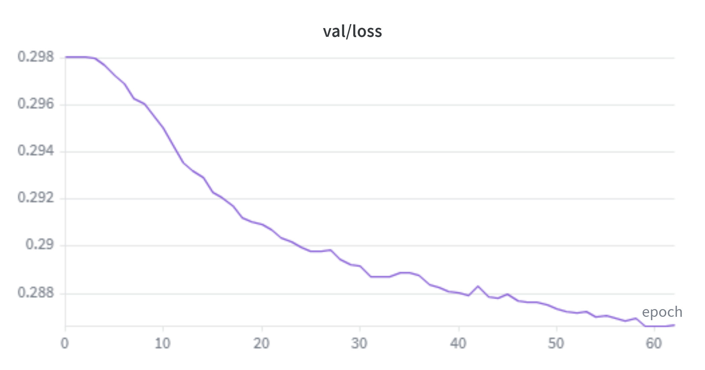 | 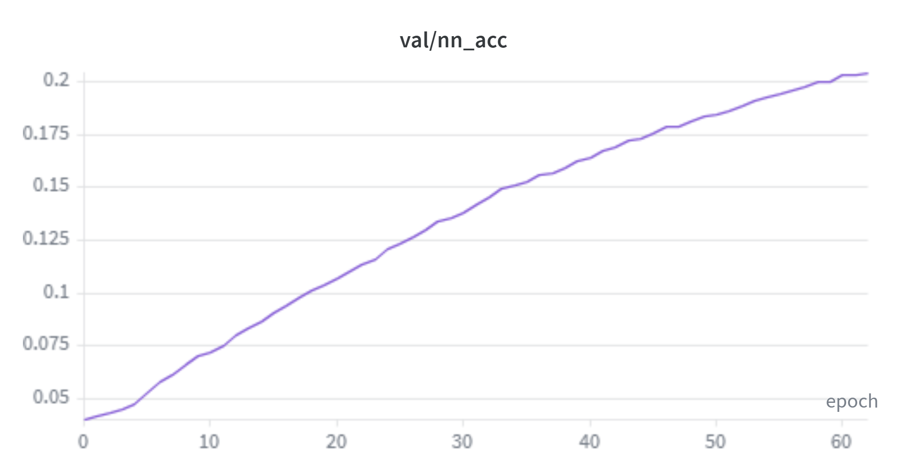 |

## 🔶 SphereFace

| Validation Loss | Validation Accuracy |
| -------------------------------------------------------- | ------------------------------------------------------ |
| 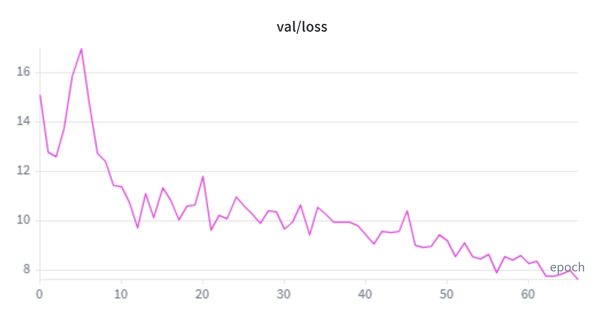 | 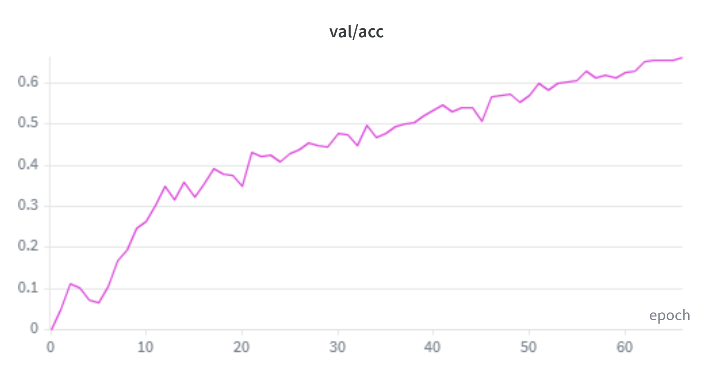 |

## 🔵 ArcFace

| Validation Loss | Validation Accuracy |
| -------------------------------------------------- | ------------------------------------------------ |
| 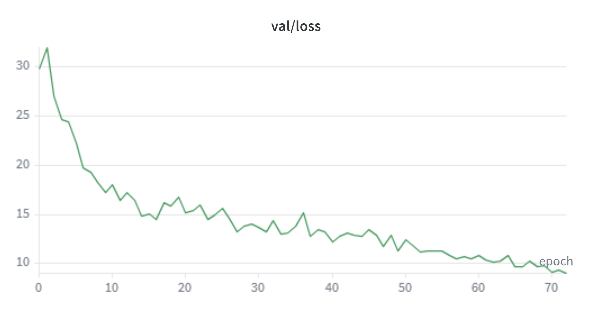 | 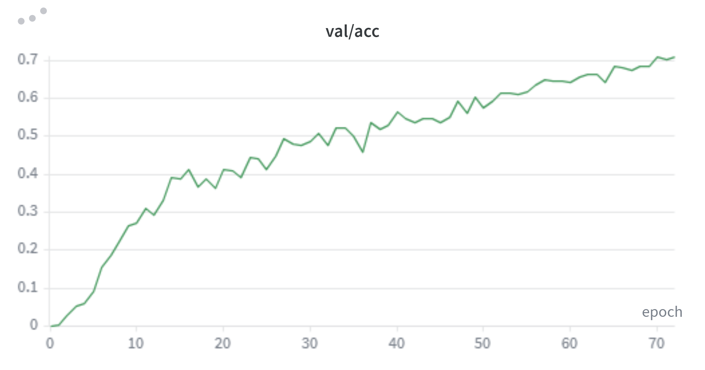 |

📂 Full W&B logs: `wandb/ROUND_1/`

---

#### 🔍 Round 1 — Insights & Observations

- **ArcFace & SphereFace:** Training was intentionally stopped before full convergence (ArcFace at epoch 72, SphereFace at epoch 67 out of a planned 100). Both models showed healthy learning curves — training accuracy reached ~93% and ~90% respectively, with validation accuracy at ~71% and ~66%. These results are expected to improve significantly once trained to completion in later rounds.

- **Triplet Loss:** Presents a contradictory and still unexplained result. Training performance was very poor — the loss barely moved across 63 epochs (0.297 → 0.287) and validation accuracy only reached ~20%, far below ArcFace and SphereFace. Yet it achieved the **best LFW verification results** of all three models (EER=0.190, AUC=0.895, F1=0.810). This contradiction is not yet fully understood.

- **Open Question — Why does Triplet verify best despite training worst?** Two hypotheses were formed:
  - **Data hypothesis:** The small dataset may be limiting ArcFace and SphereFace's ability to generalize to unseen LFW identities, while metric learning is inherently better suited to open-set verification even with limited data.
  - **Mining hypothesis:** Semi-hard mining may not be generating sufficiently informative triplets, causing the flat loss curve. The model may be learning a rough but usable embedding space early on, then stagnating.

- **General:** No definitive conclusions from Round 1 alone. The priority going into Round 2 was to test the data hypothesis for Triplet specifically, before committing resources to scaling all three models.

---

### Round 2 — Investigating Data Scaling for Triplet Loss

> **Objective:** Test whether the small dataset size was the root cause of Triplet Loss's poor training performance. ArcFace and SphereFace were not scaled in this round — they were already converging well and scaling them would consume significant compute without answering the core question about Triplet first.

#### 🔬 What Changed from Round 1

| Change | Round 1 | Round 2 |
|---|---|---|
| Triplet training data | Small capped subset | **Larger capped subset** |
| ArcFace / SphereFace data | Small capped subset | Unchanged — not retrained this round |
| Backbone | ResNet-50 | ResNet-50 *(unchanged)* |
| Everything else | — | Identical to Round 1 |

> **Rationale:** Scaling all three models at once would consume significant compute resources without a clear hypothesis to test for ArcFace and SphereFace. The experiment was scoped to Triplet only — the model with the unexplained behavior — to keep it focused and resource-efficient.

---

#### ⚙️ Training Configuration — Round 2 (Triplet only)

| Hyperparameter | Value |
|---|---|
| Backbone | ResNet-50 |
| Embedding Size | 512 |
| Optimizer | SGD |
| Learning Rate | 0.001 with cosine decay |
| Batch Size | 128 |
| Data Cap (identities) | 1000 |
| Triplet Margin | 0.3 |
| Triplet Mining | Semi-Hard Online Mining |

---

#### ⚠️ Important Note on Training Duration

Round 2 used a larger dataset, so fewer epochs were completed within the same compute budget. A direct epoch-for-epoch comparison with Round 1 is not valid — convergence with more data naturally takes longer in wall-clock time. Results should be interpreted through convergence trends, not epoch counts.

---

#### 🔍 Key Finding — Data Was Not the Problem

Triplet Loss exhibited the **same flat loss curve and low training accuracy** in Round 2 as in Round 1, despite the larger dataset. The loss trajectory and validation accuracy were nearly identical to Round 1 at the same training stage.

**This rules out data size as the primary cause of Triplet's poor training performance.**

**Conclusion:** The bottleneck is the **mining strategy**. Semi-hard online mining is not generating sufficiently informative triplets — most triplets are already satisfied before the optimizer step, the loss hovers near zero, and the model stops learning. This also reframes the Round 1 LFW result — the useful embedding was likely learned in the early epochs before mining collapsed, and does not reflect the model's true potential.

Triplet Loss training was stopped in this round. **Fixing the mining strategy is a prerequisite before any further Triplet experiments.** This will be addressed in Round 3.

---

#### 📉 Training Curves — Round 2 (Triplet)

## 🔷 Triplet Loss

| Validation Loss | Validation Accuracy |
| -------------------------------------------------- | ------------------------------------------------ |
| 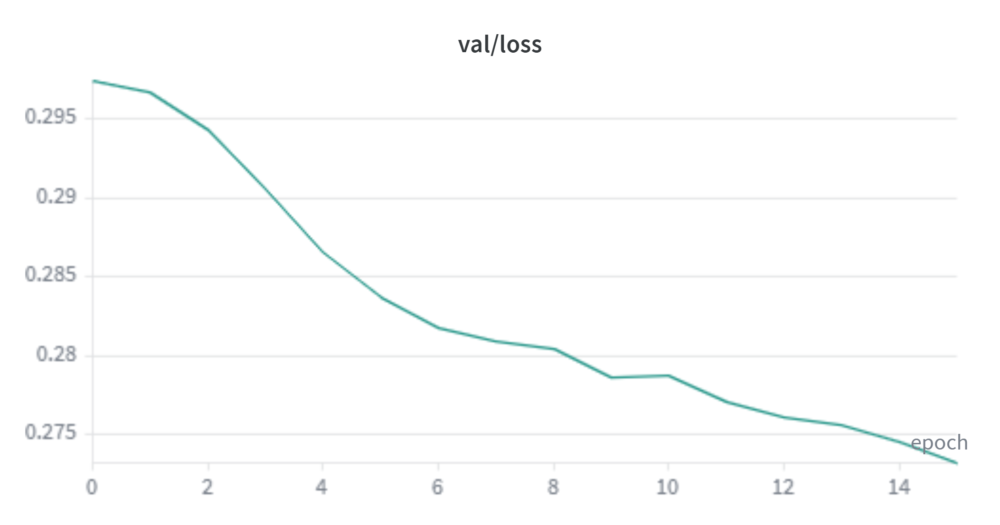 | 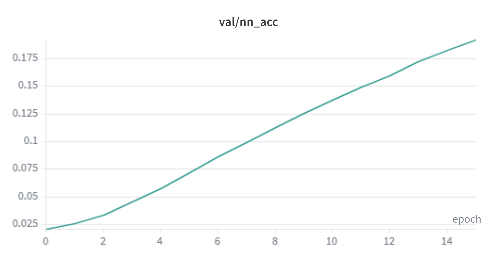 |

📂 Full W&B logs: `wandb/ROUND_2/`

---

#### 🔍 Round 2 — Insights & Observations

- **Triplet Loss:** The data hypothesis has been falsified. Scaling the dataset produced no meaningful change in training behavior — the loss curve remained flat and training accuracy stayed low. The mining strategy is confirmed as the root cause. This is a valuable negative result: it prevents wasting further compute on data scaling before the underlying issue is fixed.

- **ArcFace & SphereFace:** Not retrained in this round. Resources were deliberately preserved for Round 3, where all three models will be brought to full convergence under controlled conditions.

---

### Round 3 — Full Convergence & Fixed Triplet Mining *(Coming Soon)*

> **Objective:** Address all outstanding issues identified across Rounds 1 and 2
> in a single controlled experiment. ArcFace and SphereFace are trained to full
> convergence (100 epochs) on the same small dataset as Round 1. Triplet Loss is
> retrained from scratch with a corrected batch construction strategy and a more
> aggressive mining approach. This round will produce the first clean,
> fully-converged comparison across all three models under fair conditions.

#### 🔬 What Will Change

| Change | Previous Rounds | Round 3 |
|---|---|---|
| ArcFace / SphereFace epochs | Stopped early (~67–72) | **Full 100 epochs** |
| Triplet batch construction | Random shuffle (broken) | **PK Sampling — P identities × K images per batch** |
| Triplet mining strategy | Semi-hard (collapsed due to empty positives) | **BatchHard — hardest positive + hardest negative per anchor** |
| Dataset size | Small (R1) / Larger for Triplet (R2) | **Small dataset — same as Round 1 for all models** |
| Backbone | ResNet-50 | ResNet-50 *(unchanged)* |

> **Rationale:** Root cause analysis of Round 2 revealed that the Triplet mining
> failure was not caused by the loss implementation or the dataset size, but by
> the batch construction strategy. Random shuffling produced batches where most
> anchors had zero valid positives, silently zeroing out the loss from the early
> epochs onward. Fixing this requires two coordinated changes: a custom PK
> sampler that guarantees multiple images per identity per batch, and switching
> to BatchHard mining which is robust once positives are guaranteed. ArcFace and
> SphereFace require no structural changes — only full convergence. Scaling data
> remains deferred until all three models are confirmed to be learning correctly
> under fair conditions.

#### 🔍 Root Cause — Why Triplet Mining Was Silently Broken

The mining failure had nothing to do with the loss function code itself.
The code was correct. The problem was what it received as input.

**The batch construction problem:** The standard `DataLoader` with random
shuffling filled each batch of 512 images by sampling randomly across all
~9,000 identities. With that many identities, most batches contained only
one image per person. This means for most anchors in the batch, there was
no second image of the same identity — zero valid positives.

**How this silently zeroed the loss:** When an anchor has no valid positive
in the batch, the positive mask is all-False. The distance to the
"hardest positive" is computed as 0.0 by default. Semi-hard mining then
searches for negatives in the range `(0.0, 0.0 + margin)`. With a
pretrained backbone, almost all pairwise distances already exceed the
margin, so no semi-hard negatives are found either. The fallback to hard
mining still computes loss against `d_ap = 0.0`, which also collapses to
near zero. **The model received near-zero gradients from the very first
epoch and never recovered.**

**Why the Round 1 LFW result was misleading:** The pretrained ResNet-50
backbone already produced usable embeddings before any triplet training
began. The small amount of learning that occurred in the rare early batches
where two images of the same person happened to co-occur was enough to
slightly refine the backbone. The LFW result reflects the pretrained
backbone doing most of the work, not genuine triplet learning.

#### 📊 Results — Training Performance

| Model | Training Loss (Final) | Val Loss (Final) | Training Accuracy (Final) | Val Accuracy (Final) |
|---|---|---|---|---|
| **Triplet Loss** | *(fill in)* | *(fill in)* | *(fill in)* | *(fill in)* |
| **SphereFace** | *(fill in)* | *(fill in)* | *(fill in)* | *(fill in)* |
| **ArcFace** | *(fill in)* | *(fill in)* | *(fill in)* | *(fill in)* |

#### 🔍 Results — LFW Verification

| Model | EER ↓ | AUC ↑ | FAR ↓ | FRR ↓ | F1 ↑ |
|---|---|---|---|---|---|
| **Triplet Loss** | *(fill in)* | *(fill in)* | *(fill in)* | *(fill in)* | *(fill in)* |
| **SphereFace** | *(fill in)* | *(fill in)* | *(fill in)* | *(fill in)* | *(fill in)* |
| **ArcFace** | *(fill in)* | *(fill in)* | *(fill in)* | *(fill in)* | *(fill in)* |

#### 📈 Round 1 vs Round 3 — Improvement Summary

| Model | EER R1 | EER R3 | ΔEER | AUC R1 | AUC R3 | ΔAUC |
|---|---|---|---|---|---|---|
| **Triplet Loss** | 0.1900 | *(fill in)* | *(fill in)* | 0.8951 | *(fill in)* | *(fill in)* |
| **SphereFace** | 0.2820 | *(fill in)* | *(fill in)* | 0.7893 | *(fill in)* | *(fill in)* |
| **ArcFace** | 0.3230 | *(fill in)* | *(fill in)* | 0.7539 | *(fill in)* | *(fill in)* |

---

#### 📉 Training Curves — Round 3

## 🔷 Triplet Loss

| Validation Loss | Validation Accuracy |
| -------------------------------------------------- | ------------------------------------------------ |
| 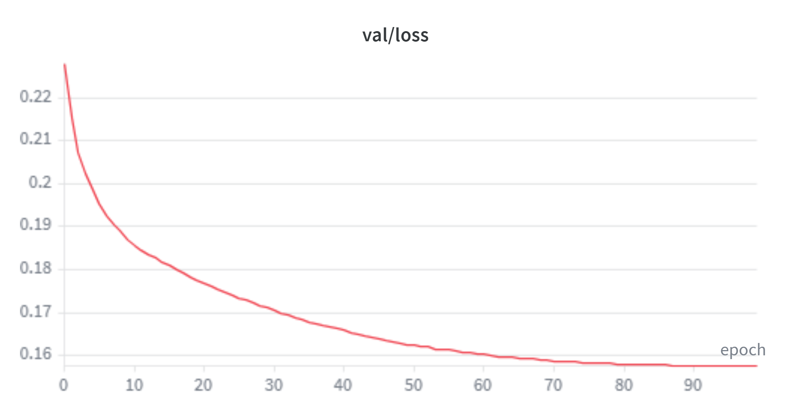 | 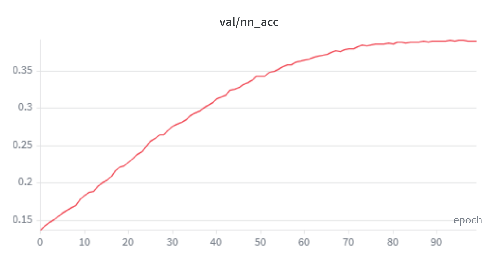 |

## 🔶 SphereFace

| Validation Loss | Validation Accuracy |
| -------------------------------------------------------- | ------------------------------------------------------ |
| 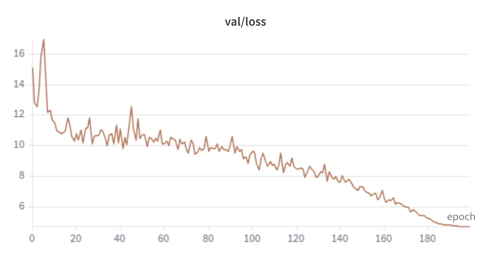 | 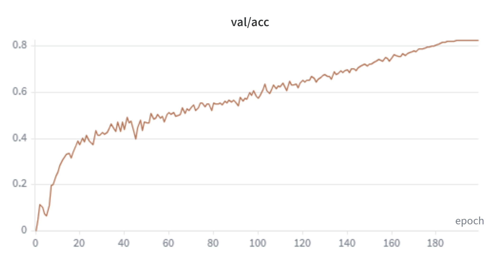 |

## 🔵 ArcFace

| Validation Loss | Validation Accuracy |
| -------------------------------------------------- | ------------------------------------------------ |
| 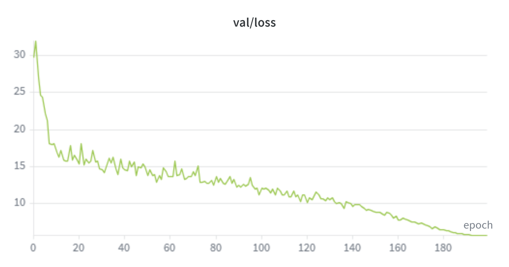 | 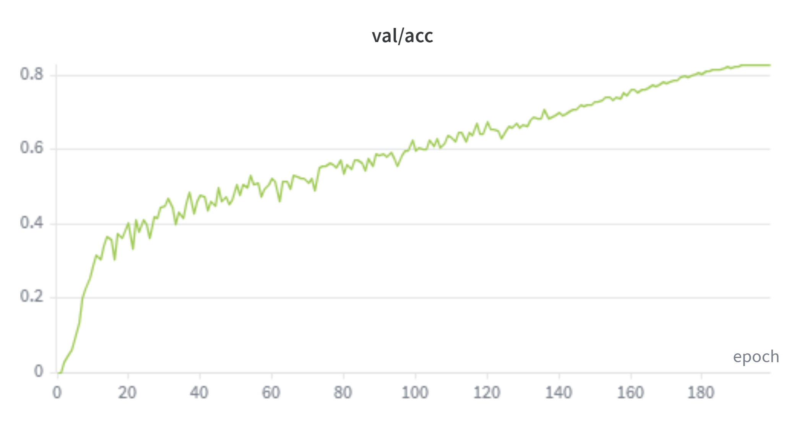 |

📂 Full W&B logs: `wandb/ROUND_3/`

---

